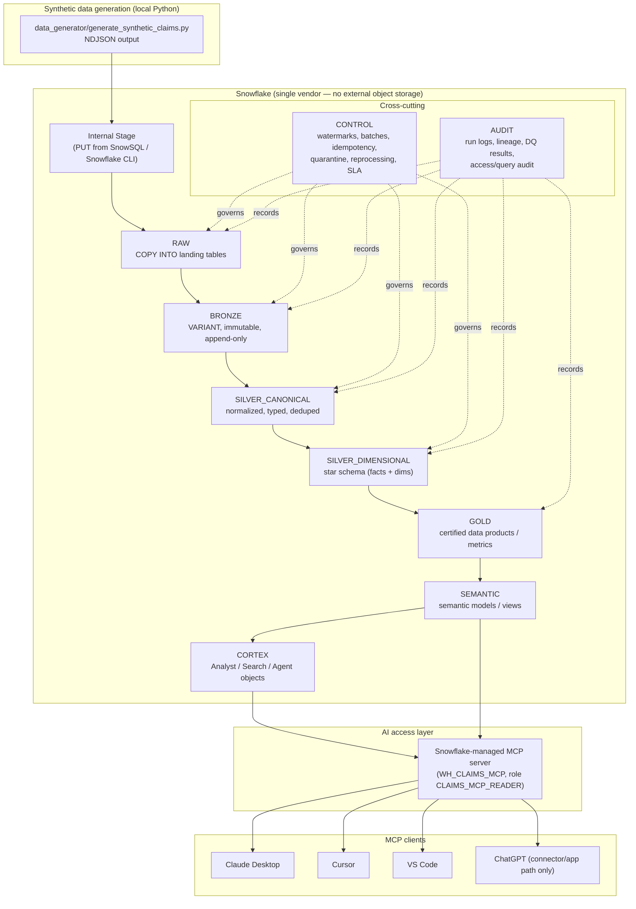

# snowflake-claims-platform

A **100% Snowflake-only** reference architecture for a **synthetic** healthcare claims data platform. It demonstrates an end-to-end, production-grade lakehouse-on-Snowflake pattern: ingestion through Snowflake internal stages, a layered medallion model (RAW -> BRONZE -> SILVER_CANONICAL -> SILVER_DIMENSIONAL -> GOLD), a governed semantic layer, Cortex (Analyst / Search / Agent), and a Snowflake-managed MCP server that exposes the platform to AI clients.

---

> # ⚠️ SYNTHETIC DATA — NOT REAL CMS / MEDICARE / MEDICAID / PHI
>
> **Every record in this platform is fully synthetic and machine-generated.** It is **not** derived from CMS RIF, Medicare claims, Medicaid TAF, any payer extract, or any real patient. It contains **no PHI and no PII**. Member IDs, provider NPIs, diagnoses, and dollar amounts are fabricated for demonstration and interview purposes only. Do **not** present this data as real claims data, and do **not** load real PHI into this repository or its Snowflake objects.

---

## Table of contents

1. [Project overview](#project-overview)
2. [Architecture](#architecture)
3. [Hard constraints](#hard-constraints)
4. [Local prerequisites](#local-prerequisites)
5. [Snowflake setup](#snowflake-setup)
6. [Terraform setup](#terraform-setup)
7. [Synthetic data generation](#synthetic-data-generation)
8. [Loading data (internal stage + PUT + COPY INTO)](#loading-data)
9. [Running dbt](#running-dbt)
10. [CI/CD behavior](#cicd-behavior)
11. [Data Control Model (DCM)](#data-control-model-dcm)
12. [Incremental strategy](#incremental-strategy)
13. [Semantic layer](#semantic-layer)
14. [Workbooks](#workbooks)
15. [Cortex: Analyst / Search / Agent](#cortex-analyst--search--agent)
16. [Snowflake-managed MCP](#snowflake-managed-mcp)
17. [Local MCP client setup](#local-mcp-client-setup)
18. [ChatGPT limitations](#chatgpt-limitations)
19. [Security notes](#security-notes)
20. [Limitations](#limitations)
21. [Docs index](#docs-index)

---

## Project overview

This repo is a **single-vendor (Snowflake) implementation** of a claims analytics platform. It shows how to build the entire stack — ingestion, transformation, orchestration, quality control, semantics, and AI access — **without any external cloud object storage or external orchestration**. There is no S3, no Azure Blob, no GCS, no Airflow, no Databricks, no Kafka, no Lambda, no Glue, no EMR. Ingestion is done **only** with Snowflake internal stages plus `PUT` and `COPY INTO`.

The platform models a realistic claims domain:

- **Claim headers** (one per claim submission) and **claim lines** (service-line detail).
- **Diagnosis** and **procedure** code associations.
- **Members**, **providers**, **payers/plans**, and **eligibility / member-months**.
- **Adjustments, voids, and reversals** (claim lifecycle).
- A formal **Data Control Model (DCM)** that governs incremental loading, idempotency, quarantine, reprocessing, freshness SLAs, lineage, and auditability.

It is designed to be **demoable in an interview** (see [`docs/demo_script_for_interviews.md`](docs/demo_script_for_interviews.md)) while still reflecting production engineering decisions.

---

## Architecture



**Layer responsibilities (summary):**

| Layer | Database.Schema | Purpose |
|---|---|---|
| Landing | `CLAIMS_*.RAW` | Raw `COPY INTO` targets; minimal typing; load metadata captured. |
| Bronze | `CLAIMS_*.BRONZE` | Immutable `VARIANT` payloads + ingest metadata; append-only history. |
| Silver (canonical) | `CLAIMS_*.SILVER_CANONICAL` | Normalized, typed, deduped, conformed business entities. |
| Silver (dimensional) | `CLAIMS_*.SILVER_DIMENSIONAL` | Star schema: `FACT_CLAIM_HEADER`, `FACT_CLAIM_LINE`, conformed dimensions. |
| Gold | `CLAIMS_*.GOLD` | Certified metrics and data products (PMPM, denial rate, condition cost). |
| Semantic | `CLAIMS_*.SEMANTIC` | Semantic models/views for Cortex Analyst and BI. |
| Cortex | `CLAIMS_*.CORTEX` | Cortex Search services, Analyst semantic model registration, Agent objects. |
| Control | `CLAIMS_*.CONTROL` | DCM operational tables (watermarks, batches, idempotency, quarantine, SLA). |
| Audit | `CLAIMS_*.AUDIT` | Run logs, DQ results, lineage, access/query audit. |

See [`docs/architecture.md`](docs/architecture.md) and [`docs/data_model.md`](docs/data_model.md) for detail.

---

## Hard constraints

These are non-negotiable design rules for this repo and are repeated throughout the docs:

- **100% Snowflake-first.** No AWS / Azure / GCP / S3 / Blob / GCS / Airflow / Databricks / Kafka / Lambda / Glue / EMR / external object storage of any kind.
- **Ingestion = Snowflake internal stages + `PUT` + `COPY INTO` only.**
- **Data is synthetic.** Never claim it is real Medicare / Medicaid / CMS RIF / TAF / PHI.
- **MCP:** the **primary** server is the **Snowflake-managed MCP server**. The **Snowflake-Labs MCP** project is a **deprecated fallback only**.

---

## Local prerequisites

You only need a local toolchain to **generate** data, **drive** Snowflake, and **run dbt**. Snowflake does all the heavy lifting.

- **Python 3.10+** (for synthetic data generation). A virtualenv is recommended.
- **SnowSQL** *or* the **Snowflake CLI** (`snow`) — used for `PUT` to internal stages and running setup SQL.
- **dbt-core** with **dbt-snowflake** adapter.
- **Terraform 1.5+** (for declarative Snowflake account objects).
- **Make** (the provided `Makefile` orchestrates everything).
- A Snowflake account with privileges to create databases, warehouses, and roles (`ACCOUNTADMIN` for initial bootstrap, or a delegated admin).

Copy the environment template and fill it in:

```bash
cp .env.example .env
# edit .env — key-pair auth is preferred over password auth
```

---

## Snowflake setup

Core infrastructure is provisioned **declaratively** as a Snowflake **DCM project**
(Declarative Change Management) under [`dcm/`](dcm/) — the Snowflake-native
counterpart to *dbt Projects on Snowflake*. You describe the desired state with
`DEFINE` statements and Snowflake computes/applies the diff (`CREATE`/`ALTER`/`DROP`)
**inside** Snowflake. This is the home for roles, warehouses, databases, schemas,
the `CONTROL`/`AUDIT`/`BRONZE` landing + `SEMANTIC` doc tables, and grants.

```bash
# one-time bootstrap (hosts the DCM PROJECT object outside the db it manages):
#   CREATE DATABASE IF NOT EXISTS OPS_DB; CREATE SCHEMA OPS_DB.DCM;
make dcm-create          # create the PROJECT object (first time)
make dcm-plan            # preview the change set (dry run)
make dcm-deploy          # apply
```

A handful of objects **cannot** be `DEFINE`d by DCM and remain imperative under
`snowflake/setup/` (run via `make sf-setup` / individual `snow sql` calls):
internal stages + file formats (`004`), streams/tasks (`007`), Cortex Search/Agent
(`009`/`010`), Snowflake-managed MCP (`011`), the semantic VIEW + MCP views (`012`,
they depend on dbt GOLD models), the external access integration + `DBT PROJECT`
object (`013`), and the `PIPELINE_CONFIG`/`DATA_CONTRACT` **seed rows** (DCM is
DDL-only). See [`dcm/README.md`](dcm/README.md) for the full managed-vs-imperative
split and the prune-safety notes.

> **Three provisioning paths, pick one for core infra:** the **DCM project**
> (Snowflake-native declarative, preferred for the single-vendor story),
> **Terraform** (external IaC alternative, below), or the original imperative
> `snowflake/setup` scripts. The imperative scripts are still required for the
> DCM-/Terraform-unsupported objects listed above regardless of which you choose.

---

## Terraform setup

Terraform manages the **declarative, account-level** Snowflake objects (databases, warehouses, roles, grants) so the platform is reproducible. dbt manages the **transformation models** inside those databases. There is **no** external cloud provider in the Terraform — only the Snowflake provider.

```bash
make tf-init
make tf-plan ENV=dev
make tf-apply ENV=dev
```

`*.tfvars` are git-ignored (except `*.example`). State files are git-ignored; use a Snowflake-appropriate backend or a secured local backend — **do not** introduce S3/GCS/Azure backends (that would violate the single-vendor constraint).

---

## Synthetic data generation

The generator produces **NDJSON** files (newline-delimited JSON) for claim headers, lines, diagnoses, procedures, members, providers, payers, and eligibility/member-months. Output lands in `data_generator/output/`.

```bash
make gen-data
# == python data_generator/generate_synthetic_claims.py
```

Output is git-ignored (only a `.gitkeep` is tracked). The generator emits realistic-but-fake distributions (claim volumes, paid amounts, denial rates, late arrivals, adjustment chains) so the DCM and incremental logic have something meaningful to exercise.

---

## Loading data

Loading is **internal stage + `PUT` + `COPY INTO` only**. No external stage, no S3/GCS/Blob.

```bash
make stage-load ENV=dev
```

Conceptually, `stage-load` does:

```sql
-- 1) (one time) an internal stage + NDJSON file format already exist (setup 006)
USE ROLE CLAIMS_LOADER;
USE WAREHOUSE WH_CLAIMS_LOAD;
USE DATABASE CLAIMS_DEV;
USE SCHEMA RAW;

-- 2) PUT local NDJSON onto the Snowflake internal stage (run via SnowSQL / snow CLI)
PUT file://data_generator/output/claim_header.ndjson @RAW.CLAIMS_INTERNAL_STAGE/claim_header/
    AUTO_COMPRESS=TRUE OVERWRITE=TRUE;

-- 3) COPY INTO the RAW landing table (capturing load metadata)
COPY INTO RAW.RAW_CLAIM_HEADER (raw_payload, source_file_name, load_ts)
FROM (
    SELECT
        $1                              AS raw_payload,
        METADATA$FILENAME               AS source_file_name,
        CURRENT_TIMESTAMP()             AS load_ts
    FROM @RAW.CLAIMS_INTERNAL_STAGE/claim_header/
)
FILE_FORMAT = (FORMAT_NAME = RAW.FF_NDJSON)
ON_ERROR = 'CONTINUE';   -- rejected rows are reconciled into CONTROL.QUARANTINE
```

The `PUT` step **must** be executed by a client that talks to the internal stage (SnowSQL or the Snowflake CLI). `COPY INTO` then loads from the internal stage into `RAW`. Batch identity and watermarks are recorded in `CONTROL` (see [DCM](#data-control-model-dcm)).

---

## Running dbt

dbt builds BRONZE -> SILVER_CANONICAL -> SILVER_DIMENSIONAL -> GOLD -> SEMANTIC. Run it against your target (`dev`/`prod`/CI):

```bash
make dbt-deps     # install packages
make dbt-seed     # load reference seeds (code sets, plan types, etc.)
make dbt-build    # run + test models in DAG order
make dbt-test     # run tests only
make dbt-docs     # generate docs + lineage graph
```

dbt models implement the DCM contracts: watermark-driven incrementals, `MERGE`-based idempotency, dedupe via `QUALIFY ROW_NUMBER()`, quarantine routing, and reconciliation tests. See [`docs/incremental_strategy.md`](docs/incremental_strategy.md).

### Running dbt **inside** Snowflake (dbt Projects on Snowflake)

The commands above run **local dbt Core** (from `./.venv`). For the fully
Snowflake-native path, the same project is deployed as a schema-level
`DBT PROJECT` object and executed **server-side** with `EXECUTE DBT PROJECT` —
no external runner, schedulable with a native **Task**:

```bash
make sf-setup                      # includes 013: external access integration + DBT schema + Task
make dbt-sf-deploy DBT_TARGET=dev  # snow dbt deploy -> creates/updates the DBT PROJECT object
make dbt-sf-deps                   # EXECUTE DBT PROJECT ... 'deps'  (server-side)
make dbt-sf-build DBT_TARGET=dev   # EXECUTE DBT PROJECT ... 'build' (server-side)
```

dbt runs **inside Snowflake** as `CLAIMS_TRANSFORMER` on `WH_CLAIMS_TRANSFORM`,
using the committed, credential-free [`dbt/snowflake_profiles/profiles.yml`](dbt/snowflake_profiles/profiles.yml)
(the connection is the Snowflake session). Note Snowflake runs dbt **1.10.15**
server-side, not 1.11. Native CD lives in
[`.github/workflows/dbt_snowflake_native_cd.yml`](.github/workflows/dbt_snowflake_native_cd.yml).
Full guide: [`docs/dbt_on_snowflake.md`](docs/dbt_on_snowflake.md).

---

## CI/CD behavior

- **PR CI (GitHub Actions):** each PR builds into an **isolated schema** `DBT_CI_PR_<PR_NUMBER>` using `WH_CLAIMS_CI` and role `CLAIMS_CI`. CI runs `dbt build --select state:modified+` against a stored manifest, with a **full-build fallback** when no prior state exists. The PR schema is dropped on close.
- **Main CD:** merges to `main` deploy to `prod` and refresh the production manifest artifact used for state comparison.
- **Auth:** **key-pair auth is preferred**; secrets are stored in GitHub Actions secrets, never in the repo.

See [`docs/ci_cd.md`](docs/ci_cd.md).

---

## Data Control Model (DCM)

The **DCM** is the operating model for production data reliability. It defines ten control domains (A–J): **Source, Batch, Watermark, Idempotency, Data Quality, Quarantine, Reprocessing, Lineage, SLA/Freshness, Semantic**. These domains are realized as `CONTROL.*` and `AUDIT.*` tables and enforced by dbt macros and tests. The DCM is what makes incremental loads, late-arriving claims, adjustments, reprocessing, quarantine, reconciliation, freshness SLAs, semantic certification, lineage, auditability, and MCP query governance behave predictably.

Read the full model — including the **Use Case -> DCM Columns -> Control Table -> dbt Macro/Test -> Behavior** matrix — in [`docs/data_control_model.md`](docs/data_control_model.md).

---

## Incremental strategy

Watermarks distinguish **`business_event_ts`** (when the claim event happened), **`source_extract_ts`** (when the source produced the extract), and **`ingest_ts`** (when Snowflake loaded it). Incrementals use a **lookback window** (`business_event_ts >= last_successful_watermark - lookback_days`) to capture late arrivals, dedupe with `natural_key + payload_hash + event_ts` via `QUALIFY ROW_NUMBER()`, and apply changes idempotently with `MERGE`. Voids, reversals, and adjustment chains are modeled explicitly. See [`docs/incremental_strategy.md`](docs/incremental_strategy.md).

---

## Semantic layer

The `SEMANTIC` schema exposes governed, certified business definitions (metrics like **paid amount**, **PMPM**, **denial rate**, **member months**) over the GOLD layer. These semantic models are the single source of truth for Cortex Analyst and for downstream BI/Workbooks, so a metric means the same thing everywhere. See [`docs/data_model.md`](docs/data_model.md) and [`docs/cortex_mcp_setup.md`](docs/cortex_mcp_setup.md).

---

## Workbooks

Snowflake **Workbooks** provide interactive SQL + chart exploration directly in Snowflake (no external BI tool, consistent with the single-vendor constraint). Starter sections include Claims Volume, Paid Amount Trend, Payer/Plan PMPM, Provider Utilization, Condition Cost, Late Arrivals Impact, a Data Quality / Quarantine dashboard, Adjustment/Reversal analysis, Eligibility member-month analysis, and Denial analysis. See [`docs/workbooks.md`](docs/workbooks.md).

---

## Cortex: Analyst / Search / Agent

- **Cortex Analyst** answers natural-language analytical questions over the `SEMANTIC` semantic model (text-to-SQL grounded in certified definitions).
- **Cortex Search** indexes textual content (e.g., claim notes, code descriptions) for retrieval.
- **Cortex Agent** orchestrates Analyst + Search + approved SQL tools to answer multi-step questions.

All Cortex objects live in the `CORTEX` schema and are exposed to clients through the Snowflake-managed MCP server. See [`docs/cortex_mcp_setup.md`](docs/cortex_mcp_setup.md).

---

## Snowflake-managed MCP

The **primary** AI access path is the **Snowflake-managed MCP server**, which runs inside Snowflake, authenticates via Snowflake roles, and uses `WH_CLAIMS_MCP` with the read-scoped role `CLAIMS_MCP_READER`. It exposes Cortex Analyst, Cortex Search, Cortex Agents, and approved SQL — all governed by Snowflake RBAC, so MCP clients can only do what the role allows.

> The **Snowflake-Labs MCP** server is a **deprecated fallback only**. Prefer the Snowflake-managed MCP server.

---

## Local MCP client setup

Configure MCP-compatible hosts (Claude Desktop, Cursor, VS Code) to connect to the Snowflake-managed MCP server. Full config examples and validation prompts are in [`docs/cortex_mcp_setup.md`](docs/cortex_mcp_setup.md).

---

## ChatGPT limitations

> **Important:** Do **not** assume all local ChatGPT installs can attach arbitrary local MCP servers.
>
> **Use this with ChatGPT only through the MCP/custom app/connector mechanism available to your ChatGPT plan and workspace. If local custom MCP is not available in your ChatGPT environment, use an MCP-compatible host such as Claude Desktop, Cursor, or VS Code, or expose a remote MCP server through the supported ChatGPT app/connector path.**

---

## Security notes

- **Key-pair auth preferred** over passwords for all programmatic access; private keys (`*.p8`) are git-ignored.
- **Least privilege RBAC:** `CLAIMS_MCP_READER` is read-only; loaders/transformers are scoped per layer; `CLAIMS_SECURITY_ADMIN` owns grants/policies.
- **No secrets in the repo:** `.env`, `*.tfvars` (except `*.example`), and keys are ignored.
- **No external object storage:** ingestion never leaves Snowflake's internal stages, eliminating an entire class of bucket-exposure risks.
- **Synthetic data only:** no PHI/PII ever enters the platform.

---

## Limitations

- Synthetic data does not capture every real-world claims edge case; distributions are illustrative.
- This is a reference architecture, not a certified production deployment — review RBAC, network policy, and cost controls before any real use.
- Cortex and MCP feature availability depend on your Snowflake edition, region, and account entitlements.
- The single-vendor constraint is intentional and means some patterns (external streaming, third-party orchestration) are deliberately out of scope.

---

## Docs index

- [`docs/architecture.md`](docs/architecture.md)
- [`docs/data_model.md`](docs/data_model.md)
- [`docs/data_control_model.md`](docs/data_control_model.md)
- [`docs/incremental_strategy.md`](docs/incremental_strategy.md)
- [`docs/ci_cd.md`](docs/ci_cd.md)
- [`dcm/README.md`](dcm/README.md) — infrastructure as a Snowflake DCM (Declarative Change Management) project
- [`docs/dbt_on_snowflake.md`](docs/dbt_on_snowflake.md) — run dbt natively inside Snowflake
- [`docs/cortex_mcp_setup.md`](docs/cortex_mcp_setup.md)
- [`docs/workbooks.md`](docs/workbooks.md)
- [`docs/runbook.md`](docs/runbook.md)
- [`docs/demo_script_for_interviews.md`](docs/demo_script_for_interviews.md)
