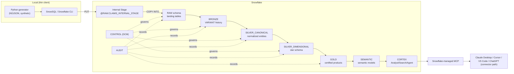
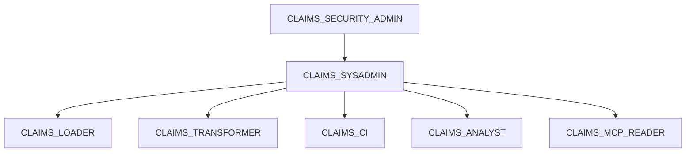

# Architecture

End-to-end architecture for **snowflake-claims-platform** — a 100% Snowflake-only synthetic healthcare claims platform.

> ⚠️ **Synthetic data.** Every record is machine-generated. It is **not** real CMS/Medicare/Medicaid/CMS RIF/TAF data and contains **no PHI/PII**.

---

## 1. Design principles

1. **Single vendor (Snowflake).** No AWS/Azure/GCP, no S3/Blob/GCS, no Airflow/Databricks/Kafka/Lambda/Glue/EMR, no external object storage. Every capability — storage, compute, orchestration, ML, semantics, AI serving — is a Snowflake feature.
2. **Internal-stage ingestion only.** Files are uploaded to a Snowflake **internal stage** with `PUT` and loaded with `COPY INTO`. There is no external stage.
3. **Medallion layering** with a clear contract at each boundary.
4. **A formal Data Control Model (DCM)** governs every load (watermarks, idempotency, quality, quarantine, reprocessing, lineage, SLA). See [`data_control_model.md`](data_control_model.md).
5. **Governed semantics first.** Metrics are defined once in `SEMANTIC` and reused by Cortex and Workbooks.
6. **AI access through Snowflake-managed MCP** with least-privilege RBAC.

---

## 2. End-to-end flow

---

## 3. Compute (warehouses) and identity (roles)

Compute is **separated by workload** so cost and concurrency are isolated:

| Warehouse | Workload |
|---|---|
| `WH_CLAIMS_LOAD` | `COPY INTO` / staging loads. |
| `WH_CLAIMS_TRANSFORM` | dbt transformations BRONZE -> GOLD. |
| `WH_CLAIMS_ANALYST` | Interactive analytics / Workbooks. |
| `WH_CLAIMS_CI` | CI builds in isolated PR schemas. |
| `WH_CLAIMS_MCP` | MCP / Cortex serving. |

Roles follow least privilege:

| Role | Scope |
|---|---|
| `CLAIMS_SYSADMIN` | Owns databases/schemas/objects. |
| `CLAIMS_LOADER` | Stage + `COPY INTO` into `RAW`. |
| `CLAIMS_TRANSFORMER` | dbt builds across BRONZE..GOLD/SEMANTIC. |
| `CLAIMS_ANALYST` | Read GOLD/SEMANTIC. |
| `CLAIMS_CI` | Build into `DBT_CI_PR_*` schemas. |
| `CLAIMS_MCP_READER` | Read-only access used by MCP. |
| `CLAIMS_SECURITY_ADMIN` | Grants, masking, row-access policies. |

---

## 4. Layer responsibilities

| Layer (schema) | Contract |
|---|---|
| `RAW` | Exact landing of staged files. Captures `source_file_name`, `load_ts`, batch id. Minimal typing. |
| `BRONZE` | Immutable, append-only `VARIANT` payload + ingest metadata + `payload_hash`. Full replay history. |
| `SILVER_CANONICAL` | Typed, normalized, **deduped** business entities. One row per natural key per event. |
| `SILVER_DIMENSIONAL` | Star schema: `FACT_CLAIM_HEADER`, `FACT_CLAIM_LINE`, conformed dimensions (member, provider, payer/plan, date, diagnosis, procedure). |
| `GOLD` | Certified data products and metrics (PMPM, denial rate, condition cost, member-months). |
| `SEMANTIC` | Semantic views/models — single source of metric truth for Cortex/Workbooks. |
| `CORTEX` | Cortex Search services, Analyst semantic model registration, Agent objects. |
| `CONTROL` | DCM operational tables. |
| `AUDIT` | Run logs, DQ results, lineage, access audit. |

---

## 5. No external object storage — why and how

The single-vendor rule eliminates external buckets entirely. Practical implications:

- **Files** are uploaded to a **Snowflake internal stage** with `PUT`; nothing is ever written to S3/GCS/Blob.
- **State** for Terraform should use a Snowflake-friendly or secured-local backend — **never** an S3/GCS/Azure backend.
- **Orchestration** is **Snowflake Tasks** (and Streams/Dynamic Tables), not Airflow.
- This removes a whole class of misconfigured-bucket exposure risk and keeps governance inside Snowflake RBAC.

---

## 6. When to use which Snowflake mechanism

There are several ways to move/transform data in Snowflake. Pick deliberately:

| Mechanism | Use it when | Avoid when |
|---|---|---|
| **dbt** | You want version-controlled, tested, DAG-ordered SQL transformations with the DCM contracts (the default for BRONZE->GOLD). | You need always-on micro-latency refresh. |
| **Snowflake Tasks** | You need scheduled/triggered orchestration *inside* Snowflake (run the dbt-equivalent SQL, kick reprocessing, refresh). Replaces Airflow. | One-off ad-hoc transforms. |
| **Streams** | You need change-data-capture between layers (process only new/changed rows since last consume). | Full-refresh tables where CDC adds no value. |
| **Dynamic Tables** | You want declarative, incrementally-maintained tables with a target lag and minimal orchestration code. | You need complex multi-step tested logic that belongs in dbt, or precise DCM watermark/quarantine control. |
| **Workbooks** | Interactive exploration, charts, and demos directly in Snowflake. | Production pipeline logic (use dbt). |
| **Cortex (Analyst/Search/Agent)** | Natural-language analytics, retrieval, and agentic answers over the certified semantic layer. | Deterministic operational reporting better served by SQL/Workbooks. |

**Rule of thumb:** dbt owns the modeled pipeline and its tests; **Tasks** schedule/trigger it; **Streams** feed incrementals; **Dynamic Tables** handle simple declaratively-maintained derivations; **Workbooks** and **Cortex** are the consumption surfaces. All of it stays inside Snowflake.

---

## 7. Cross-cutting governance

- **DCM** (`CONTROL` + `AUDIT`) wraps every load: watermarks, idempotency, DQ, quarantine, reprocessing, lineage, SLA. See [`data_control_model.md`](data_control_model.md).
- **Incremental strategy** (watermarks + lookback + dedupe + MERGE) in [`incremental_strategy.md`](incremental_strategy.md).
- **Security:** key-pair auth preferred, least-privilege roles, optional masking/row-access policies owned by `CLAIMS_SECURITY_ADMIN`.

---

## 8. AI serving

The `SEMANTIC` + `CORTEX` schemas are exposed to AI clients through the **Snowflake-managed MCP server** (primary). The **Snowflake-Labs MCP** is a **deprecated fallback only**. Details in [`cortex_mcp_setup.md`](cortex_mcp_setup.md).
