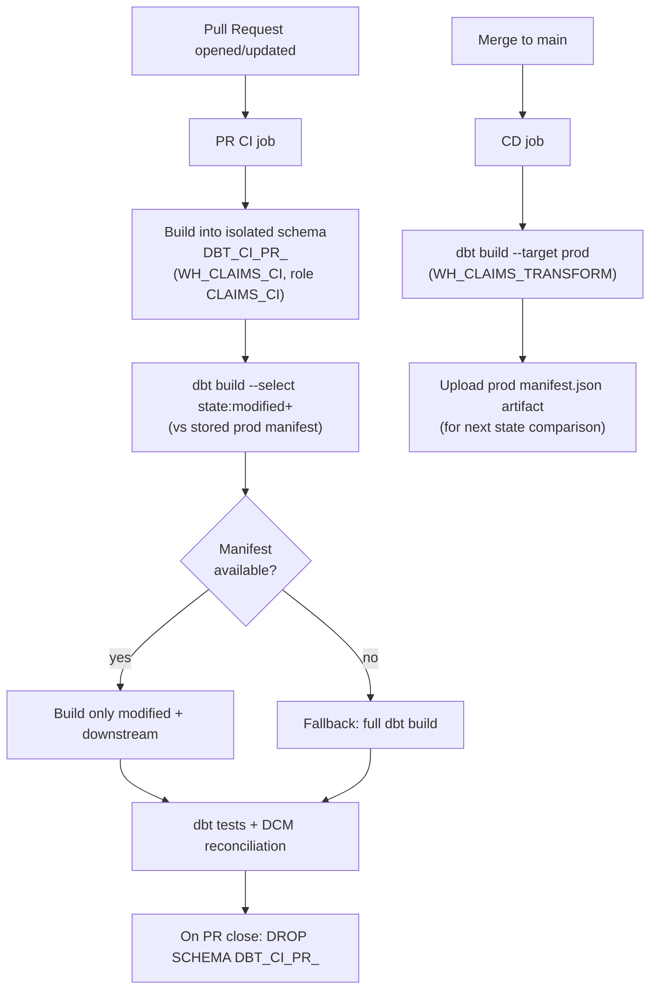

# CI/CD

GitHub Actions CI/CD for the dbt project. Everything targets Snowflake only — there is no external build infra beyond GitHub Actions runners invoking dbt against Snowflake.

> ⚠️ **Synthetic data.** CI runs against synthetic data only; no PHI.

---

## 1. Pipeline overview



---

## 2. PR CI

Each PR:

1. **Isolated schema.** Builds into `DBT_CI_PR_<PR_NUMBER>` so concurrent PRs never collide and `prod`/`dev` are untouched. Uses warehouse `WH_CLAIMS_CI` and role `CLAIMS_CI` (which can create/drop only `DBT_CI_PR_*` schemas in `CLAIMS_DEV`).
2. **State-based selection.** Downloads the latest **production `manifest.json`** artifact and runs:
   ```bash
   dbt build --select state:modified+ --state ./prod_manifest --target ci
   ```
   Only changed models and their downstream dependents build — fast, cheap CI.
3. **Fallback.** If no prior manifest exists (first run, lost artifact), fall back to a full build:
   ```bash
   dbt build --target ci
   ```
4. **Tests.** dbt tests run as part of `build`, including DCM reconciliation tests (header=sum(lines), adjustment chains, member-month non-overlap, freshness).
5. **Cleanup.** On PR close/merge, a workflow drops `DBT_CI_PR_<PR_NUMBER>` to reclaim storage.

Example CI target in `profiles.yml`:

```yaml
claims:
  target: ci
  outputs:
    ci:
      type: snowflake
      account: "{{ env_var('SNOWFLAKE_ACCOUNT') }}"
      user: "{{ env_var('SNOWFLAKE_USER') }}"
      role: CLAIMS_CI
      warehouse: WH_CLAIMS_CI
      database: CLAIMS_DEV
      schema: "DBT_CI_PR_{{ env_var('PR_NUMBER') }}"
      authenticator: snowflake_jwt          # key-pair auth preferred
      private_key_path: "{{ env_var('SNOWFLAKE_PRIVATE_KEY_PATH') }}"
      threads: 8
```

---

## 3. Main CD

On merge to `main`:

1. Build production with role `CLAIMS_TRANSFORMER`, warehouse `WH_CLAIMS_TRANSFORM`, database `CLAIMS_PROD`:
   ```bash
   dbt build --target prod
   ```
2. **Publish manifest.** Upload `target/manifest.json` as a build artifact (and/or to a Snowflake-internal stage). This is the **state baseline** PRs compare against — it is what makes `state:modified+` work.

---

## 4. dbt state comparison & manifest artifacts

- `state:modified+` compares the current code's manifest to the **stored prod manifest** to compute the minimal set of models to build (modified + downstream `+`).
- Manifests are passed between jobs as **GitHub Actions artifacts** (no S3/GCS — keeps the single-vendor constraint; artifacts live in GitHub, not cloud object storage).
- Deferral (`--defer`) lets PR builds reference unchanged prod models instead of rebuilding them.

---

## 5. Secrets & auth

- **Key-pair auth is preferred.** Store the private key (`SNOWFLAKE_PRIVATE_KEY`) and account/user as **GitHub Actions secrets**; never in the repo. `.p8` files are git-ignored.
- `PR_NUMBER` is injected from the GitHub event context to name the isolated schema.
- Roles are least-privilege: `CLAIMS_CI` for PRs, `CLAIMS_TRANSFORMER` for CD.

---

## 6. Workflow skeleton

```yaml
name: dbt-ci
on:
  pull_request: { branches: [main] }
  push:         { branches: [main] }

jobs:
  build:
    runs-on: ubuntu-latest
    env:
      SNOWFLAKE_ACCOUNT: ${{ secrets.SNOWFLAKE_ACCOUNT }}
      SNOWFLAKE_USER:    ${{ secrets.SNOWFLAKE_USER }}
      SNOWFLAKE_PRIVATE_KEY_PATH: ./key.p8
      PR_NUMBER: ${{ github.event.number }}
    steps:
      - uses: actions/checkout@v4
      - run: printf '%s' "${{ secrets.SNOWFLAKE_PRIVATE_KEY }}" > key.p8
      - run: pip install dbt-snowflake
      - run: dbt deps
      - name: Download prod manifest (state baseline)
        uses: actions/download-artifact@v4
        with: { name: prod-manifest, path: ./prod_manifest }
        continue-on-error: true            # enables fallback
      - name: Build (PR = sliced, main = full prod)
        run: |
          if [ "${{ github.event_name }}" = "pull_request" ]; then
            dbt build --target ci --select state:modified+ --state ./prod_manifest --defer \
              || dbt build --target ci      # fallback full build
          else
            dbt build --target prod
          fi
      - name: Publish prod manifest
        if: github.ref == 'refs/heads/main'
        uses: actions/upload-artifact@v4
        with: { name: prod-manifest, path: target/manifest.json }
```

A separate `on: pull_request: types: [closed]` workflow drops `DBT_CI_PR_<PR_NUMBER>`.
