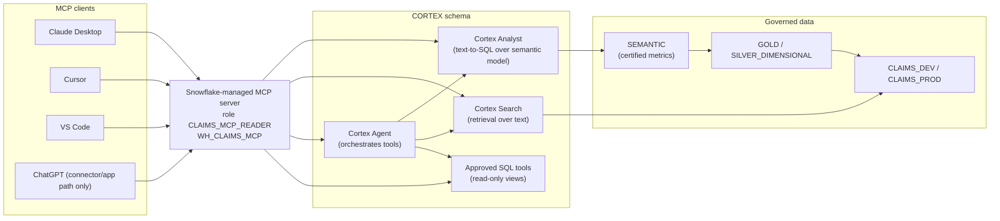

# Cortex & MCP Setup

How to expose the platform to AI clients using **Snowflake Cortex** (Analyst / Search / Agent) and the **Snowflake-managed MCP server** — the primary AI access path. Everything stays inside Snowflake.

> ⚠️ **Synthetic data.** Not real CMS/Medicare/Medicaid/PHI. Cortex/MCP answer over synthetic claims only.
>
> **MCP:** the **primary** server is the **Snowflake-managed MCP server**. The **Snowflake-Labs MCP** project is a **deprecated fallback only**.

---

## 1. Architecture



The MCP server authenticates as a **read-only Snowflake role** (`CLAIMS_MCP_READER`), so clients can only do what RBAC allows. Every MCP query is audited (`AUDIT.ACCESS_AUDIT`) — this is the **MCP query governance** control in the DCM.

---

## 2. Role & grant setup

`CLAIMS_MCP_READER` is **read-only** and scoped to the consumption layers:

```sql
USE ROLE CLAIMS_SECURITY_ADMIN;

-- Read-only access to certified consumption schemas only.
GRANT USAGE ON DATABASE CLAIMS_PROD TO ROLE CLAIMS_MCP_READER;
GRANT USAGE ON SCHEMA CLAIMS_PROD.SEMANTIC TO ROLE CLAIMS_MCP_READER;
GRANT USAGE ON SCHEMA CLAIMS_PROD.GOLD     TO ROLE CLAIMS_MCP_READER;
GRANT USAGE ON SCHEMA CLAIMS_PROD.CORTEX   TO ROLE CLAIMS_MCP_READER;

GRANT SELECT ON ALL VIEWS  IN SCHEMA CLAIMS_PROD.SEMANTIC TO ROLE CLAIMS_MCP_READER;
GRANT SELECT ON FUTURE VIEWS IN SCHEMA CLAIMS_PROD.SEMANTIC TO ROLE CLAIMS_MCP_READER;
GRANT SELECT ON ALL TABLES IN SCHEMA CLAIMS_PROD.GOLD      TO ROLE CLAIMS_MCP_READER;

-- Compute.
GRANT USAGE ON WAREHOUSE WH_CLAIMS_MCP TO ROLE CLAIMS_MCP_READER;

-- Cortex object usage (Search service, Analyst semantic model, Agent).
GRANT USAGE ON CORTEX SEARCH SERVICE CLAIMS_PROD.CORTEX.CLAIMS_SEARCH TO ROLE CLAIMS_MCP_READER;
```

No `INSERT/UPDATE/DELETE/MERGE` is granted — MCP traffic cannot mutate data.

---

## 3. Semantic model setup (Cortex Analyst)

Cortex Analyst answers natural-language questions by generating SQL grounded in a **semantic model** built over the certified `SEMANTIC`/`GOLD` layer. Define dimensions, measures, and metrics with synonyms so a metric means the same thing every time.

```yaml
# semantic/claims_semantic_model.yaml (registered into CORTEX)
name: claims_semantic_model
description: Certified claims metrics over synthetic data (no PHI).
tables:
  - name: fact_claim_header
    base_table: { database: CLAIMS_PROD, schema: SILVER_DIMENSIONAL, table: FACT_CLAIM_HEADER }
    dimensions:
      - { name: payer_id, expr: payer_id }
      - { name: plan_type, expr: plan_type, synonyms: ["plan", "product"] }
      - { name: claim_status, expr: claim_status }
    time_dimensions:
      - { name: service_month, expr: DATE_TRUNC('month', service_start_dt) }
    measures:
      - { name: total_paid, expr: SUM(total_paid_amt), synonyms: ["paid amount", "paid"] }
      - { name: claim_count, expr: COUNT(*) }
metrics:
  - name: pmpm
    description: Per-member-per-month paid amount.
    expr: SUM(total_paid_amt) / NULLIF(SUM(member_months), 0)
  - name: denial_rate
    expr: SUM(IFF(claim_status='denied',1,0)) / NULLIF(COUNT(*),0)
```

Only **CERTIFIED** metrics (per `CONTROL.SEMANTIC_CERTIFICATION`) are exposed.

---

## 4. Cortex Search setup

Index textual content (code descriptions, claim notes) for retrieval:

```sql
USE ROLE CLAIMS_SYSADMIN;
CREATE OR REPLACE CORTEX SEARCH SERVICE CLAIMS_PROD.CORTEX.CLAIMS_SEARCH
  ON content
  ATTRIBUTES code_system, code
  WAREHOUSE = WH_CLAIMS_MCP
  TARGET_LAG = '1 hour'
  AS
    SELECT diagnosis_code AS code, 'ICD10' AS code_system, description AS content
    FROM CLAIMS_PROD.SILVER_DIMENSIONAL.DIM_DIAGNOSIS
    UNION ALL
    SELECT procedure_code AS code, 'CPT' AS code_system, description AS content
    FROM CLAIMS_PROD.SILVER_DIMENSIONAL.DIM_PROCEDURE;
```

---

## 5. Cortex Agent setup

The Agent orchestrates Analyst (structured analytics) + Search (retrieval) + approved read-only SQL tools to answer multi-step questions. Configure it with the semantic model, the search service, and a small set of vetted SQL tools (read-only views in `SEMANTIC`/`GOLD`). The Agent runs under `CLAIMS_MCP_READER`, inheriting the same read-only governance.

---

## 6. Snowflake-managed MCP configuration (primary)

Configure the **Snowflake-managed MCP server** to publish the Analyst semantic model, the Cortex Search service, the Agent, and the approved SQL tools, all bound to `CLAIMS_MCP_READER` / `WH_CLAIMS_MCP`. The managed server runs inside Snowflake and is reached by clients over the supported managed endpoint. Because it is managed, you do not self-host a process — you configure which Cortex objects and SQL tools it exposes and which role it uses.

> **Fallback only:** if the managed server is unavailable in your account, the **Snowflake-Labs MCP** server can be self-hosted as a **deprecated fallback**. Prefer the managed server.

---

## 7. Client configuration examples

The exact transport/URL comes from your Snowflake-managed MCP endpoint. The shapes below show how each host registers an MCP server.

**Claude Desktop** (`claude_desktop_config.json`):

```json
{
  "mcpServers": {
    "snowflake-claims": {
      "command": "snowflake-mcp-client",
      "args": ["--account", "YOUR_ORG-YOUR_ACCOUNT",
               "--role", "CLAIMS_MCP_READER",
               "--warehouse", "WH_CLAIMS_MCP",
               "--authenticator", "snowflake_jwt",
               "--private-key-path", "/abs/path/rsa_key.p8"]
    }
  }
}
```

**Cursor** (`.cursor/mcp.json`):

```json
{
  "mcpServers": {
    "snowflake-claims": {
      "command": "snowflake-mcp-client",
      "args": ["--account", "YOUR_ORG-YOUR_ACCOUNT", "--role", "CLAIMS_MCP_READER",
               "--warehouse", "WH_CLAIMS_MCP", "--authenticator", "snowflake_jwt"]
    }
  }
}
```

**VS Code** (`.vscode/mcp.json` or MCP extension settings): same server block as above. Use the workspace MCP configuration supported by your VS Code MCP extension.

Key-pair auth (`snowflake_jwt`) is preferred everywhere.

---

## 8. ChatGPT connector/app limitations

> **Important — do not assume all local ChatGPT installs can attach arbitrary local MCP servers.**
>
> **Use this with ChatGPT only through the MCP/custom app/connector mechanism available to your ChatGPT plan and workspace. If local custom MCP is not available in your ChatGPT environment, use an MCP-compatible host such as Claude Desktop, Cursor, or VS Code, or expose a remote MCP server through the supported ChatGPT app/connector path.**

Whether ChatGPT can reach this server depends on your **plan** and **workspace** and the connector/app path they enable — it is **not** guaranteed and is **not** the same as the local-config flow used by Claude Desktop/Cursor/VS Code. If your ChatGPT environment supports a custom connector/app to a remote MCP endpoint, expose the Snowflake-managed MCP through that supported path; otherwise use one of the MCP-compatible hosts above.

---

## 9. Validation prompts

After wiring a client to the MCP server, validate with these prompts. They exercise Analyst, Search, the certified semantics, and the DCM-backed governance:

1. "What was **total paid by month** for the last 12 months?"
2. "**Define PMPM by plan type** and show it for the last quarter."
3. "Who are the **top providers for diabetes** by paid amount?"
4. "**Why did March paid change** versus February? Break it down."
5. "What is the **denial rate by payer** this year?"
6. "What is the **grain of `fact_claim_line`**?"
7. "Show me **quarantined records and why** they were quarantined."
8. "Explain the **adjustment/reversal model** and how it affects paid totals."

Correct answers should (a) use certified metric definitions, (b) respect the synthetic-data disclaimer, and (c) never attempt writes.
