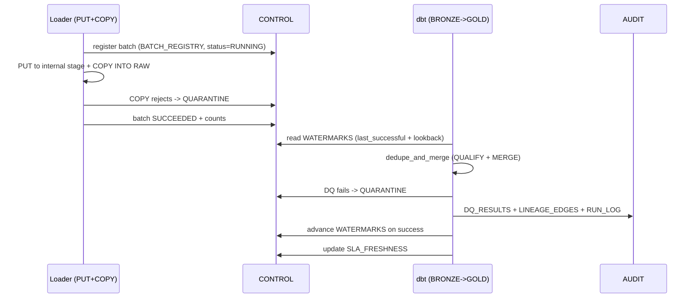

# Data Control Model (DCM)

The **DCM is the operating model for production data reliability** in this platform. It is the contract that makes loads **incremental, idempotent, auditable, recoverable, and trustworthy** — the difference between a demo pipeline and one you can run in production. Every load and transform in this platform is wrapped by the DCM, realized as `CONTROL.*` and `AUDIT.*` tables and enforced by dbt macros and tests.

> ⚠️ **Synthetic data.** Not real CMS/Medicare/Medicaid/PHI. The DCM governs synthetic records only.

---

## 1. Why a DCM

Healthcare claims are messy: claims arrive late, get adjusted, voided, and reversed; the same batch can be loaded twice; a bad source file can poison a layer; and analysts need to know *why* a number changed. The DCM answers, for every load:

- **What** did we load (source, batch)?
- **How far** are we caught up (watermark)?
- **Did we already load this** (idempotency)?
- **Is it good** (data quality)?
- **What failed and why** (quarantine)?
- **Can we safely re-run** (reprocessing)?
- **Where did it come from** (lineage)?
- **Is it fresh enough** (SLA/freshness)?
- **Is the metric certified** (semantic)?

---

## 2. Control domains A–J

The DCM is organized into ten domains. Each domain owns a set of columns that appear on control tables and/or on every modeled row.

### Domain A — Source

Describes the origin of data.

| Column | Meaning |
|---|---|
| `source_system` | Logical source (synthetic generator id). |
| `source_object` | Object name (claim_header, claim_line, …). |
| `source_file_name` | Staged file (`METADATA$FILENAME`). |
| `source_extract_ts` | When the source produced the extract. |
| `source_record_count` | Declared record count for reconciliation. |

### Domain B — Batch

Identifies each load unit.

| Column | Meaning |
|---|---|
| `batch_id` | Unique id for a stage+COPY unit of work. |
| `batch_status` | RUNNING / SUCCEEDED / FAILED / QUARANTINED. |
| `batch_started_ts`, `batch_ended_ts` | Batch timing. |
| `rows_loaded`, `rows_rejected` | COPY outcome counts. |

### Domain C — Watermark

Tracks how far each model is caught up.

| Column | Meaning |
|---|---|
| `model_name` | Target model/table. |
| `business_event_ts` | When the event happened (primary watermark). |
| `source_extract_ts` | Extract time (secondary). |
| `ingest_ts` | Snowflake load time (operational). |
| `last_successful_watermark` | Max processed `business_event_ts`. |
| `lookback_days` | Window subtracted to catch late arrivals. |

### Domain D — Idempotency

Guarantees re-running produces the same result.

| Column | Meaning |
|---|---|
| `natural_key` | Business key (e.g., claim_id). |
| `payload_hash` | Hash of business fields. |
| `idempotency_key` | `natural_key` + `payload_hash` + event ts. |
| `merge_action` | INSERT/UPDATE/NOOP recorded by MERGE. |

### Domain E — Data Quality

Validation results per model/run.

| Column | Meaning |
|---|---|
| `dq_check_name` | e.g., not_null_claim_id, paid_nonnegative. |
| `dq_severity` | WARN / ERROR. |
| `dq_status` | PASS / FAIL. |
| `dq_failed_count` | Rows failing the check. |

### Domain F — Quarantine

Holds rejected/failed rows for inspection and replay.

| Column | Meaning |
|---|---|
| `quarantine_id` | Surrogate. |
| `batch_id`, `model_name` | Origin. |
| `reject_reason` | Why quarantined (DQ fail, COPY reject, dedupe loser). |
| `raw_payload` | Original VARIANT for replay. |
| `quarantined_ts`, `is_resolved` | Lifecycle. |

### Domain G — Reprocessing

Controls safe re-runs and backfills.

| Column | Meaning |
|---|---|
| `reprocess_id` | Request id. |
| `target_model`, `from_ts`, `to_ts` | Window to rebuild. |
| `reason` | Adjustment correction, DQ fix, schema change. |
| `reprocess_status` | REQUESTED / RUNNING / DONE. |

### Domain H — Lineage

Records what produced what.

| Column | Meaning |
|---|---|
| `run_id` | dbt/Task run id. |
| `parent_model`, `child_model` | Edge in the DAG. |
| `rows_in`, `rows_out` | Volume per edge. |
| `transform_type` | merge / insert / dynamic_table. |

### Domain I — SLA / Freshness

Tracks whether data is fresh enough.

| Column | Meaning |
|---|---|
| `model_name` | Monitored model. |
| `max_business_event_ts` | Newest event present. |
| `freshness_lag` | now - newest event/load. |
| `sla_threshold` | Allowed lag. |
| `sla_status` | OK / BREACH. |

### Domain J — Semantic

Certifies business definitions.

| Column | Meaning |
|---|---|
| `metric_name` | e.g., pmpm, denial_rate. |
| `definition_sql` | Canonical computation. |
| `certification_status` | DRAFT / CERTIFIED / DEPRECATED. |
| `owner`, `certified_ts` | Stewardship. |

---

## 3. CONTROL and AUDIT tables

### `CONTROL.*` (operational state)

| Table | Domain(s) | Purpose |
|---|---|---|
| `CONTROL.SOURCE_REGISTRY` | A | Known sources/objects and expected counts. |
| `CONTROL.BATCH_REGISTRY` | B | One row per load batch and its status/counts. |
| `CONTROL.WATERMARKS` | C | Per-model last successful watermark + lookback. |
| `CONTROL.IDEMPOTENCY_KEYS` | D | Seen idempotency keys / merge outcomes. |
| `CONTROL.QUARANTINE` | F | Rejected rows + reason + raw payload. |
| `CONTROL.REPROCESS_REQUESTS` | G | Backfill / reprocessing requests. |
| `CONTROL.SLA_FRESHNESS` | I | Freshness thresholds and current status. |
| `CONTROL.SEMANTIC_CERTIFICATION` | J | Certified metric definitions. |

### `AUDIT.*` (immutable history / evidence)

| Table | Domain(s) | Purpose |
|---|---|---|
| `AUDIT.RUN_LOG` | B, G | Every run/batch with timing and outcome. |
| `AUDIT.DQ_RESULTS` | E | Per-check results per run. |
| `AUDIT.LINEAGE_EDGES` | H | DAG edges + row counts per run. |
| `AUDIT.ACCESS_AUDIT` | — | Who/what queried (incl. MCP query governance). |

---

## 4. DCM in action — use-case matrix

This is the heart of the DCM: how each production use case maps to specific DCM columns, the control table that holds the state, the dbt macro/test that enforces it, and the resulting behavior.

| Use Case | DCM Columns | Control Table | dbt Macro/Test | Behavior |
|---|---|---|---|---|
| **Incremental load** | `business_event_ts`, `last_successful_watermark`, `lookback_days` | `CONTROL.WATERMARKS` | macro `get_incremental_filter()` (`business_event_ts >= last_successful_watermark - lookback_days`) | Only new/late rows since watermark minus lookback are processed; watermark advanced on success. |
| **Late-arriving claims** | `business_event_ts`, `ingest_ts`, `lookback_days` | `CONTROL.WATERMARKS`, `GOLD.LATE_ARRIVALS` | macro `apply_lookback_window()` + test `late_arrival_within_lookback` | Claims with old `business_event_ts` but recent `ingest_ts` are re-captured by the lookback window and correctly attributed to the original period. |
| **Idempotent load** | `natural_key`, `payload_hash`, `idempotency_key`, `merge_action` | `CONTROL.IDEMPOTENCY_KEYS` | macro `dedupe_and_merge()` (`QUALIFY ROW_NUMBER()` + `MERGE`) | Re-running the same batch is a no-op; duplicate payloads collapse to one row; merge action recorded. |
| **Reprocessing** | `reprocess_id`, `from_ts`, `to_ts`, `reason`, `reprocess_status` | `CONTROL.REPROCESS_REQUESTS` | macro `reprocess_window()` | A bounded window is rebuilt from BRONZE deterministically; watermark/idempotency keep results consistent. |
| **Claim adjustment** | `adjustment_of_claim_id`, `natural_key`, `business_event_ts` | `CONTROL.IDEMPOTENCY_KEYS` | macro `resolve_adjustment_chain()` + test `adjustment_chain_resolves` | Latest version in the adjustment chain wins; superseded versions are excluded from current-state facts but kept in BRONZE. |
| **Quarantine** | `reject_reason`, `raw_payload`, `is_resolved` | `CONTROL.QUARANTINE` | macro `route_to_quarantine()` + test `quarantine_growth_within_threshold` | Rows failing DQ or COPY rejects are diverted (not silently dropped) for inspection and replay. |
| **Line/header reconciliation** | `claim_id`, `total_paid_amt`, line `line_paid_amt` | `AUDIT.DQ_RESULTS` | test `header_equals_sum_of_lines` | `SUM(line.paid) = header.paid` per claim; failures recorded and (optionally) quarantined. |
| **Eligibility reconstruction** | member key, `coverage_start_dt`, `coverage_end_dt` | `AUDIT.DQ_RESULTS` | macro `explode_member_months()` + test `member_months_non_overlapping` | Coverage spans become non-overlapping member-months — the certified PMPM denominator. |
| **Freshness SLA** | `max_business_event_ts`, `freshness_lag`, `sla_threshold`, `sla_status` | `CONTROL.SLA_FRESHNESS` | test `freshness_within_sla` (dbt `source freshness` + custom) | Stale models flagged BREACH; alerting/runbook triggered. |
| **Semantic certification** | `metric_name`, `definition_sql`, `certification_status` | `CONTROL.SEMANTIC_CERTIFICATION` | test `metric_is_certified` | Only CERTIFIED metric definitions are exposed via SEMANTIC/Cortex. |
| **Lineage** | `run_id`, `parent_model`, `child_model`, `rows_in/out` | `AUDIT.LINEAGE_EDGES` | post-hook `log_lineage_edge()` | Every transform records its inputs/outputs and volumes for traceability. |
| **Auditability** | `run_id`, `batch_id`, timing, outcome | `AUDIT.RUN_LOG`, `AUDIT.DQ_RESULTS` | on-run-start/on-run-end hooks `log_run()` | Every run/batch is logged immutably — you can reconstruct exactly what ran, when, and with what result. |
| **MCP query governance** | querying role, statement, timestamp | `AUDIT.ACCESS_AUDIT` | view + `CLAIMS_MCP_READER` grants | MCP traffic runs as read-only `CLAIMS_MCP_READER`; every query is audited; no writes possible. |

---

## 5. How the DCM is enforced (lifecycle)

1. **on-run-start:** open `AUDIT.RUN_LOG`, register/resume batch.
2. **incremental filter:** read `CONTROL.WATERMARKS`, apply lookback.
3. **dedupe + merge:** idempotent upsert; losers/rejects to `CONTROL.QUARANTINE`.
4. **DQ + reconciliation tests:** write `AUDIT.DQ_RESULTS`.
5. **lineage:** post-hook writes `AUDIT.LINEAGE_EDGES`.
6. **on-run-end:** advance `CONTROL.WATERMARKS`, update `CONTROL.SLA_FRESHNESS`, close `AUDIT.RUN_LOG`.

This loop runs inside Snowflake (dbt on `WH_CLAIMS_TRANSFORM`, orchestrated by Snowflake Tasks if scheduled).

See [`incremental_strategy.md`](incremental_strategy.md) for the SQL behind watermarks, lookback, dedupe, and MERGE, and [`runbook.md`](runbook.md) for operating the DCM.
