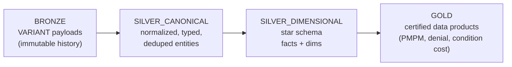
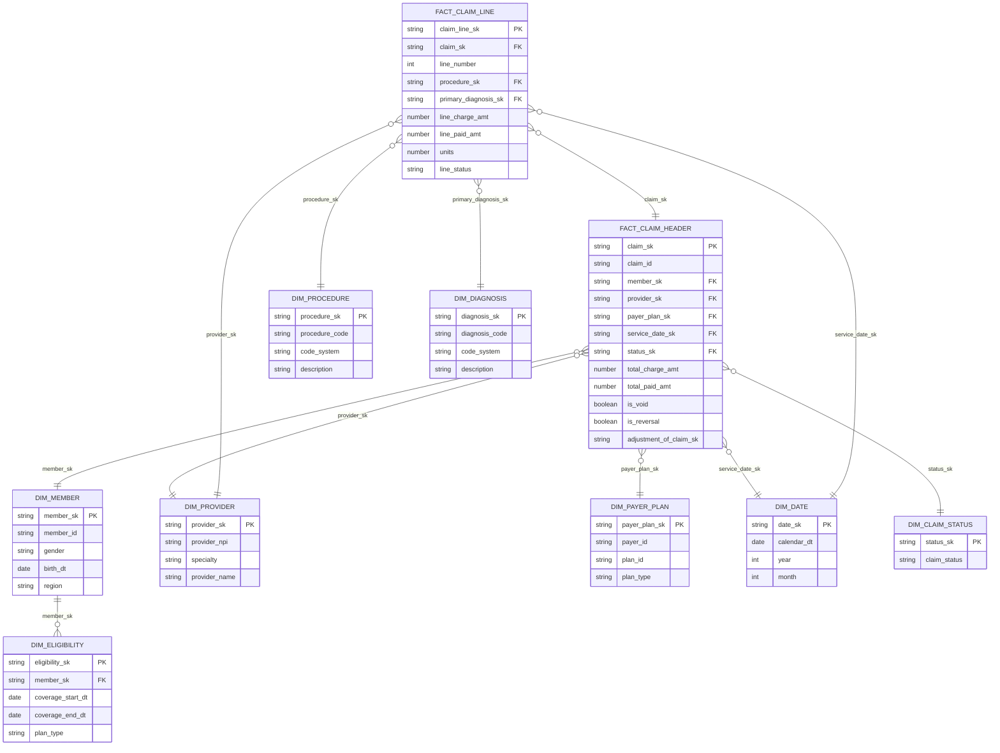

# Data Model

The claims data model across BRONZE, SILVER_CANONICAL, SILVER_DIMENSIONAL, and GOLD.

> ⚠️ **Synthetic data.** Not real CMS/Medicare/Medicaid/PHI. All keys, codes, and amounts are fabricated.

---

## 1. Layered modeling overview



- **Bronze** keeps the raw truth (every version of every record), so we can always replay.
- **Silver canonical** turns variant blobs into clean, typed, deduplicated rows — one row per natural key per business event.
- **Silver dimensional** reshapes canonical entities into a star schema for analytics.
- **Gold** publishes certified metrics and data products consumed by the semantic layer.

---

## 2. Bronze (VARIANT) model

Bronze tables are **append-only** and store the entire source record as a `VARIANT`, plus ingest metadata. Nothing is overwritten; corrections arrive as new rows and are resolved downstream.

```sql
-- CLAIMS_*.BRONZE.BR_CLAIM_HEADER
CREATE TABLE IF NOT EXISTS BRONZE.BR_CLAIM_HEADER (
    bronze_id          STRING        DEFAULT UUID_STRING(),  -- surrogate
    payload            VARIANT,                              -- full source record
    natural_key        STRING,                               -- e.g. claim_id
    payload_hash       STRING,                               -- hash of business fields
    business_event_ts  TIMESTAMP_NTZ,                        -- when the event happened
    source_extract_ts  TIMESTAMP_NTZ,                        -- when source produced extract
    ingest_ts          TIMESTAMP_NTZ DEFAULT CURRENT_TIMESTAMP(),
    batch_id           STRING,                               -- CONTROL.BATCH_REGISTRY
    source_file_name   STRING
);
```

The three timestamps (`business_event_ts`, `source_extract_ts`, `ingest_ts`) are the foundation of the incremental strategy (see [`incremental_strategy.md`](incremental_strategy.md)). `payload_hash` enables idempotent dedupe.

There is a bronze table per source object: `BR_CLAIM_HEADER`, `BR_CLAIM_LINE`, `BR_CLAIM_DIAGNOSIS`, `BR_CLAIM_PROCEDURE`, `BR_MEMBER`, `BR_PROVIDER`, `BR_PAYER_PLAN`, `BR_ELIGIBILITY`.

---

## 3. Silver canonical (normalized)

Canonical models flatten the variant, cast types, apply dedupe, and resolve the claim lifecycle. Example header:

```sql
-- CLAIMS_*.SILVER_CANONICAL.CLAIM_HEADER
SELECT
    payload:claim_id::STRING            AS claim_id,          -- natural key
    payload:member_id::STRING           AS member_id,
    payload:provider_npi::STRING        AS provider_npi,
    payload:payer_id::STRING            AS payer_id,
    payload:plan_id::STRING             AS plan_id,
    payload:claim_type::STRING          AS claim_type,        -- professional/institutional
    payload:claim_status::STRING        AS claim_status,      -- paid/denied/pending
    payload:adjustment_of_claim_id::STRING AS adjustment_of_claim_id, -- lifecycle link
    payload:is_void::BOOLEAN            AS is_void,
    payload:is_reversal::BOOLEAN        AS is_reversal,
    payload:total_charge_amt::NUMBER(18,2) AS total_charge_amt,
    payload:total_paid_amt::NUMBER(18,2)   AS total_paid_amt,
    payload:service_start_dt::DATE      AS service_start_dt,
    payload:service_end_dt::DATE        AS service_end_dt,
    business_event_ts,
    source_extract_ts,
    ingest_ts
FROM BRONZE.BR_CLAIM_HEADER
-- keep only the latest version per claim (idempotent dedupe)
QUALIFY ROW_NUMBER() OVER (
    PARTITION BY payload:claim_id::STRING
    ORDER BY business_event_ts DESC, source_extract_ts DESC, ingest_ts DESC
) = 1;
```

Canonical entities: `CLAIM_HEADER`, `CLAIM_LINE`, `CLAIM_DIAGNOSIS`, `CLAIM_PROCEDURE`, `MEMBER`, `PROVIDER`, `PAYER_PLAN`, `ELIGIBILITY`.

---

## 4. Claims grain (header vs line vs diagnosis vs procedure)

Understanding grain is the single most important modeling decision here.

| Entity | Grain | Notes |
|---|---|---|
| **Claim header** | **One row per claim submission** (per `claim_id`/version). | Carries member, provider, payer/plan, status, total charge/paid, service span, lifecycle links (adjustment/void/reversal). |
| **Claim line** | **One row per service line** within a claim. | Carries procedure/revenue code, units, line charge/paid, line status. A claim has 1..N lines. **`SUM(line.paid) = header.paid`** is a reconciliation invariant. |
| **Claim diagnosis** | **One row per (claim, diagnosis code, position)**. | Diagnosis codes attached to a claim, ordered (principal vs secondary). Many-per-claim. |
| **Claim procedure** | **One row per (claim line, procedure code)**. | Procedure/CPT/HCPCS codes performed; tied to the line grain. |

> **Header vs line:** the header is the *claim*; the line is the *service*. Money and units live at the line grain and roll up to the header. Diagnoses describe *why*; procedures describe *what was done*.

---

## 5. Silver dimensional (star schema)

Two fact tables at the two natural grains, surrounded by conformed dimensions.



Facts: `FACT_CLAIM_HEADER`, `FACT_CLAIM_LINE`. Dimensions: `DIM_MEMBER`, `DIM_PROVIDER`, `DIM_PAYER_PLAN`, `DIM_DATE`, `DIM_DIAGNOSIS`, `DIM_PROCEDURE`, `DIM_ELIGIBILITY`, `DIM_CLAIM_STATUS`.

**Member-months / eligibility** are derived from `DIM_ELIGIBILITY` by exploding coverage spans into one row per member per calendar month — the denominator for PMPM.

---

## 6. Gold semantic data products

Gold publishes certified, business-facing products built from the star schema:

| Gold product | Grain | Key measures |
|---|---|---|
| `GOLD.CLAIMS_MONTHLY` | payer/plan x month | total_paid, total_charge, claim_count, denied_count, denial_rate |
| `GOLD.PMPM_BY_PLAN` | plan_type x month | paid_amount, member_months, **PMPM = paid / member_months** |
| `GOLD.CONDITION_COST` | diagnosis (condition) x month | paid_amount, member_count, cost_per_member |
| `GOLD.PROVIDER_UTILIZATION` | provider x month | claim_count, line_count, paid_amount |
| `GOLD.MEMBER_MONTHS` | member x month | coverage flag (eligibility denominator) |
| `GOLD.DENIAL_SUMMARY` | payer x month | submitted, denied, denial_rate |
| `GOLD.LATE_ARRIVALS` | month x ingest-lag bucket | claims arriving after period close |

These products are exposed through the `SEMANTIC` schema so a metric (e.g., **PMPM**, **denial rate**) means exactly the same thing in Cortex Analyst and in Workbooks.

---

## 7. Reconciliation invariants (enforced by dbt tests)

- `SUM(FACT_CLAIM_LINE.line_paid_amt) = FACT_CLAIM_HEADER.total_paid_amt` per claim.
- Every `FACT_CLAIM_LINE.claim_sk` resolves to a `FACT_CLAIM_HEADER`.
- Voids/reversals net to zero against their original claim.
- Member-months are non-overlapping per member.

See [`data_control_model.md`](data_control_model.md) and [`incremental_strategy.md`](incremental_strategy.md) for how these invariants are operationalized.
