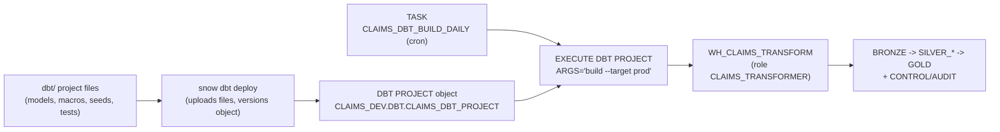

# Running dbt **inside** Snowflake (dbt Projects on Snowflake)

> Synthetic data — not real CMS / Medicare / Medicaid / PHI.

This platform supports three ways to run dbt. This document covers the most
Snowflake-native one: **dbt Projects on Snowflake**, where the dbt project is a
schema-level `DBT PROJECT` object and dbt executes **server-side** with
`EXECUTE DBT PROJECT`, running server-side inside Snowflake.

| Path | Where dbt runs | When to use |
|---|---|---|
| Local dbt Core (`make dbt-build`) | Your laptop, via `./.venv` | Day-to-day development, fast iteration, SSO. |
| GitHub Actions + dbt Core (`dbt_main_cd.yml`) | GitHub runner | CI gating on PRs; portable, vendor-neutral. |
| **dbt Projects on Snowflake (this doc)** | **Inside Snowflake** | **Native prod orchestration; no runner; schedule with Tasks.** |

All three execute the **same** dbt project in `dbt/`. They differ only in *where*
the dbt process runs and *how* it authenticates.

---

## 1. How it works



The deployed dbt runs as the **role declared in the project's `profiles.yml`
outputs** (`CLAIMS_TRANSFORMER`), further restricted to the calling user's
privileges, on `WH_CLAIMS_TRANSFORM`.

---

## 2. Two profiles.yml — and why

Local dbt Core and in-Snowflake dbt need **different** `profiles.yml` files:

| | `dbt/profiles.yml` (local, **git-ignored**) | `dbt/snowflake_profiles/profiles.yml` (committed) |
|---|---|---|
| Connection | `account` + `user` + `authenticator: externalbrowser` (SSO) | **None** — uses the current Snowflake **session** |
| Contents | full connection | only `type/database/role/schema/warehouse` |
| Safe to commit? | No (account locator) | **Yes** (no credentials) |

Both declare the **same profile name** (`claims_platform`, matching
`dbt/dbt_project.yml`) and the same targets (`dev` → `CLAIMS_DEV`,
`prod` → `CLAIMS_PROD`).

> **Schema routing:** `dbt/macros/generate_schema_name.sql` makes the per-folder
> `+schema` values (BRONZE, SILVER_CANONICAL, GOLD, …) apply **verbatim**, so dbt
> builds into exactly the schemas the setup scripts, Cortex services, semantic
> views, and MCP grants reference — under both execution modes.

---

## 3. dbt version: local 1.11 vs Snowflake 1.10.15

Snowflake runs a **Snowflake-supported dbt Core version server-side** — currently
**1.10.15** or 1.9.4 (and dbt Fusion 2.0 preview). It does **not** run dbt 1.11.

- The `DBT PROJECT` object pins `DBT_VERSION = '1.10.15'`.
- Your local `./.venv` uses dbt 1.11 (fine for dev + `dbt parse`).
- For strict parity you can pin local to 1.10.15, but this project compiles
  cleanly under both. Treat the in-Snowflake build as the source of truth for
  prod.

See: <https://docs.snowflake.com/en/user-guide/data-engineering/dbt-projects-on-snowflake-dbt-core-versions>

---

## 4. One-time platform setup

Run the setup script (needs `ACCOUNTADMIN` for the external access integration):

```bash
make sf-setup            # runs 001..013 in order
# or just the dbt-on-Snowflake pieces:
snow sql --connection my_example_connection \
  --filename snowflake/setup/013_create_dbt_on_snowflake.sql
```

`013_create_dbt_on_snowflake.sql` creates:

- schema `CLAIMS_DEV.DBT` to hold the project object;
- `NETWORK RULE` + `EXTERNAL ACCESS INTEGRATION CLAIMS_DBT_EAI` so server-side
  `dbt deps` can download packages (dbt_utils, dbt_expectations);
- grants (`CREATE DBT PROJECT`, integration `USAGE`) to `CLAIMS_TRANSFORMER`;
- a suspended `TASK CLAIMS_DBT_BUILD_DAILY` that runs `build --target prod` on a
  cron schedule;
- (optional, commented) a Git repository object for git-native deploys.

> **No-egress alternative:** instead of the integration, pre-fetch packages
> locally (`make dbt-deps`) and deploy them with
> `snow dbt deploy ... --install-local-deps`, then drop
> `--external-access-integration` and `EXTERNAL_ACCESS_INTEGRATIONS`.

---

## 5. Deploy and run

### From the Makefile (uses your `snow` connection)

```bash
make dbt-sf-deploy DBT_TARGET=dev     # snow dbt deploy -> creates/updates the object
make dbt-sf-deps                       # EXECUTE DBT PROJECT ... 'deps'
make dbt-sf-build DBT_TARGET=dev       # EXECUTE DBT PROJECT ... 'build'
make dbt-sf-test  DBT_TARGET=dev       # EXECUTE DBT PROJECT ... 'test'
```

### Raw CLI

```bash
snow dbt deploy CLAIMS_DBT_PROJECT \
  --source dbt \
  --profiles-dir dbt/snowflake_profiles \
  --default-target dev \
  --external-access-integration CLAIMS_DBT_EAI \
  --connection my_example_connection --force
```

### Raw SQL (in Snowsight or `snow sql`)

```sql
EXECUTE DBT PROJECT CLAIMS_DEV.DBT.CLAIMS_DBT_PROJECT ARGS = 'deps';
EXECUTE DBT PROJECT CLAIMS_DEV.DBT.CLAIMS_DBT_PROJECT ARGS = 'build --target dev';
EXECUTE DBT PROJECT CLAIMS_DEV.DBT.CLAIMS_DBT_PROJECT ARGS = 'build --select silver_canonical+ --target dev';
```

---

## 6. Scheduling (native orchestration)

The `TASK` created in setup is the Snowflake-native scheduler — no Airflow, no
external cron:

```sql
-- Activate the daily prod build:
ALTER TASK CLAIMS_DEV.DBT.CLAIMS_DBT_BUILD_DAILY RESUME;

-- Run it once on demand:
EXECUTE TASK CLAIMS_DEV.DBT.CLAIMS_DBT_BUILD_DAILY;     -- or: make dbt-sf-run-task

-- Inspect history:
SELECT * FROM TABLE(CLAIMS_DEV.INFORMATION_SCHEMA.TASK_HISTORY())
ORDER BY scheduled_time DESC;
```

You can also chain Tasks (DAG) — e.g. `stage-load` → `dbt build` → a freshness
check — using `AFTER` dependencies, all in Snowflake.

---

## 7. CI/CD that deploys into Snowflake

`.github/workflows/dbt_snowflake_native_cd.yml` runs on merge to `main`:
it installs only the Snowflake CLI, deploys the project with `snow dbt deploy`
(key-pair auth — SSO can't be used headless), then `EXECUTE DBT PROJECT` for
`deps` + `build`. **dbt itself runs inside Snowflake**, not on the runner.

This complements `dbt_pr_ci.yml` (PR gating with dbt Core in an isolated CI
schema). Pick the native workflow as your prod path for the 100%-Snowflake story.

---

## 8. Observability

- `SHOW DBT PROJECTS IN SCHEMA CLAIMS_DEV.DBT;`
- Each `EXECUTE DBT PROJECT` is a Snowflake query — find it in **Query History**
  and the `TASK_HISTORY` table function above.
- dbt run artifacts (`run_results.json`, `manifest.json`) are captured by the
  execution; review run status in Snowsight's dbt project UI.
- Platform-level run/lineage/DQ records still land in `CONTROL.PIPELINE_RUN`,
  `AUDIT.LINEAGE_EVENT`, and `AUDIT.DATA_QUALITY_RESULT` via the model post-hooks
  and tests — identical to local/Actions runs.

---

## 9. Limitations & gotchas

- **dbt version** is whatever Snowflake supports (1.10.15 / 1.9.4), not 1.11.
- **`dbt deps` needs egress** (the external access integration) — or bundle deps
  with `--install-local-deps`.
- The **target schema in `profiles.yml` must exist** before `CREATE DBT PROJECT`
  (setup creates `CONTROL`, which it uses as the default).
- **Auth:** `EXECUTE DBT PROJECT` uses the session; deploys from CI use key-pair.
  `externalbrowser` works for local interactive deploys only.
- Some dbt adapters/packages/Python-model features have server-side
  restrictions — see Snowflake's limitations page:
  <https://docs.snowflake.com/en/user-guide/data-engineering/dbt-projects-on-snowflake-limitations>

---

### References
- dbt Projects on Snowflake: <https://docs.snowflake.com/en/user-guide/data-engineering/dbt-projects-on-snowflake>
- `CREATE DBT PROJECT`: <https://docs.snowflake.com/en/sql-reference/sql/create-dbt-project>
- `EXECUTE DBT PROJECT`: <https://docs.snowflake.com/en/sql-reference/sql/execute-dbt-project>
- `snow dbt` CLI: <https://docs.snowflake.com/en/developer-guide/snowflake-cli/data-pipelines/dbt-projects>
