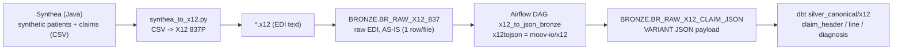

# Synthea → X12 837P → JSON → canonical (the EDI claims pipeline)

> Synthetic data — not real CMS/Medicare/Medicaid/PHI.

A second synthetic-claims source that exercises a realistic **EDI** path: generate
synthetic patients/claims with **Synthea**, render them as **X12 837P** (the
standard professional-claim EDI format), ingest the raw EDI **as-is** into
Bronze, parse it to JSON with **[moov-io/x12](https://github.com/moov-io/x12)**
inside an **Airflow** pipeline, land the JSON back in Bronze, and build a
**canonical** claim model from it in dbt — alongside the original NDJSON source.



## Components

| Path | What it is |
|---|---|
| `data_generator/synthea/` | `run_synthea.sh` (downloads + runs Synthea, CSV export), `synthea_to_x12.py` (Synthea CSV → valid X12 837P, one subscriber HL loop per claim) |
| `x12/` | `x12tojson` — a Go CLI over **moov-io/x12** that emits a **flat, labeled** segment stream (`_segment` name + `claim_seq`) so the JSON is navigable in SQL |
| `snowflake/setup/015_create_x12_bronze.sql` | `BR_RAW_X12_837` (raw) + `BR_RAW_X12_CLAIM_JSON` (JSON) + stage/format (also in `dcm/` as DEFINE) |
| `snowflake/load/load_x12_raw.py` | ingest the raw `.x12` files AS-IS into `BR_RAW_X12_837` (ISA13 = natural key) |
| `airflow/dags/x12_to_json_dag.py` | the Airflow pipeline: read raw X12 → `x12tojson` (moov-io/x12) → JSON → `BR_RAW_X12_CLAIM_JSON` (quarantines parse failures) |
| `dbt/models/silver_canonical/x12/` | `int_x12_claim_segments`, `claim_header_x12`, `claim_line_x12`, `claim_diagnosis_x12` |

## Why a labeled JSON

moov-io/x12 parses X12 into a rule-positional tree where segments carry only
element positions (`"01"`, `"02"`, …) with **no segment name** — you can't tell a
`CLM` from an `NM1` in SQL. Each moov segment exposes `Name()`, so `x12tojson`
walks the document in order and emits:

```json
{ "interchange_control_number":"000000001", "transaction_type":"837p",
  "segments":[
    {"_segment":"NM1","claim_seq":0,"01":"85","03":"BILLING ORG","09":"9000000001"},
    {"_segment":"CLM","claim_seq":1,"01":"<claimid>","02":"553.96","05":{"01":"11"}},
    {"_segment":"HI","claim_seq":1,"01":{"01":"BK","02":"<dx>"}},
    {"_segment":"SV1","claim_seq":1,"01":"HC<97530","02":"174","04":"3"},
    {"_segment":"DTP","claim_seq":1,"01":"472","02":"D8","03":"20240118"} ] }
```

`claim_seq` increments at each subscriber `HL` loop (`HL03="22"`), so a claim and
all its segments share one `claim_seq`; billing-provider/file-level segments are
`claim_seq 0`. The dbt models `LATERAL FLATTEN(payload:segments)` and filter by
`_segment` + `claim_seq`, using `segment_index` (document order) to tie each
`SV1` line to its preceding `LX` (line number) and following `DTP` (service date).

## Run it

```bash
# 1) generate Synthea data + X12 (Java + Python; deterministic with --seed)
bash data_generator/synthea/run_synthea.sh            # -> output/csv + output/x12
#    (or: python data_generator/synthea/synthea_to_x12.py)

# 2) build the converter
( cd x12 && go build -o x12tojson . )

# 3) create bronze + ingest raw X12 as-is
snow sql -c my_example_connection --filename snowflake/setup/015_create_x12_bronze.sql
python snowflake/load/load_x12_raw.py

# 4) Airflow pipeline parses X12 -> JSON (moov-io/x12) -> BR_RAW_X12_CLAIM_JSON
#    (x12tojson is baked into the Airflow image; trigger the DAG)
kubectl exec -n airflow deploy/airflow-scheduler -c scheduler -- \
  airflow dags trigger x12_to_json_bronze

# 5) build the canonical claim model from the JSON bronze
snow sql -c my_example_connection \
  -q "EXECUTE DBT PROJECT CLAIMS_DEV.DBT.CLAIMS_DBT_PROJECT ARGS='build --select silver_canonical.x12+ --target dev';"
```

## Notes

- **moov-io/x12 is a Go library** (no CLI/Docker image in v0.1.0); `x12/` is the
  thin wrapper, built into the Airflow image via a multi-stage Go build.
- Synthea specifics handled by the converter: `PLACEOFSERVICE` is a UUID → POS
  defaults to `11`; diagnosis/procedure codes are SNOMED-numeric (passed through);
  state names are mapped to USPS abbreviations; NPIs are synthetic (`9`-prefixed).
- This is an **additional** source; the original `data_generator/generate_synthetic_claims.py`
  (NDJSON → `BR_RAW_CLAIM_EVENT`) still feeds the main canonical/dimensional/gold layers.
